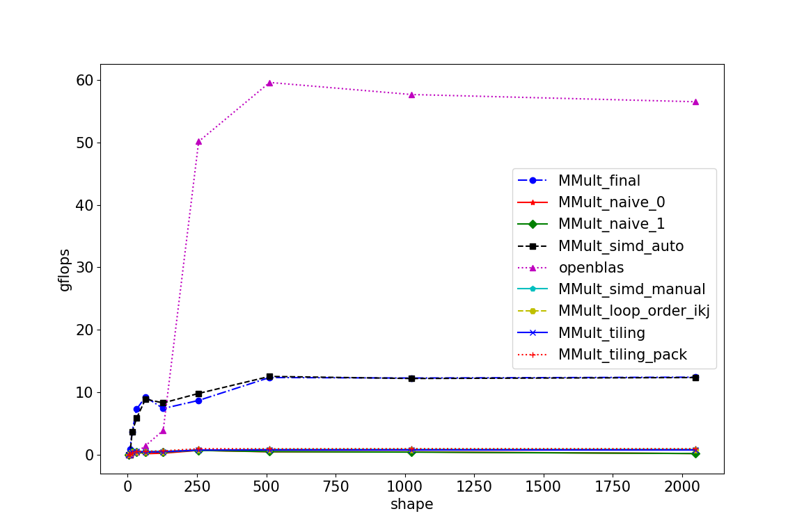
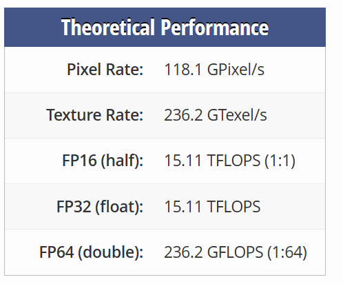
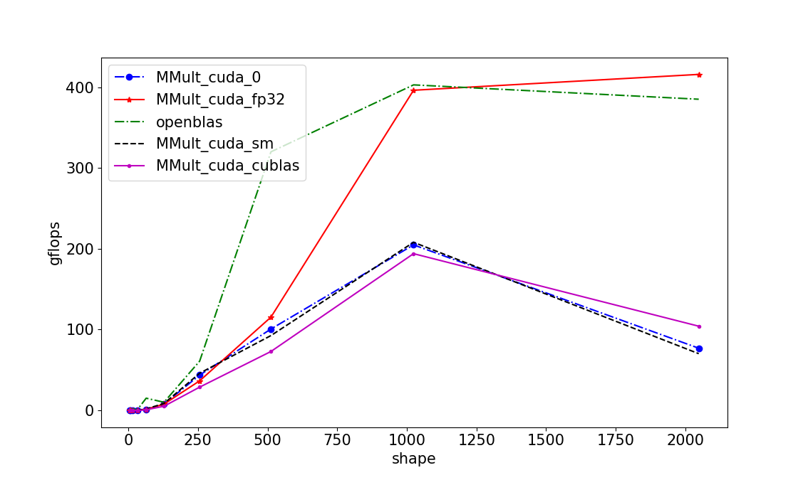

课程信息：高性能计算应用实践、2025秋  
实验名称：应用优化 上课地点：T2612
姓名：古权胜 学号：2024311286 班级：计信14 

### 实验环境
| 版本 | CPU单核优化   | GPU实现及优化 |
| :--- | :----------- | -----------------: |
| cpu  | kunpeng --- 4核 ARM |Intel(R) Core(TM) i7-14650HX 16核 x86_64| 
| os   | Ubuntu 24.04.2 |  WSL-Ubuntu 24.04 |
| gpu  | - | NVIDIA GeForce GTX 4060 Laptop |

### 实现及说明
### 矩阵乘法单核优化（5分）
  #### 基本编译优化
   1. 添加编译选项`-funroll-loops -fomit-frame-pointer -mtune=native -ffast-math`即循环展开、寄存器优化、调度优化和放宽浮点限制。
   2. 性能略微提升
  #### 循环顺序重排  
   1. **原理**：Naive实现中矩阵为行主序，而二维数组按行连续储存，初始的ijk顺序，内层循环中B(k,j)按列访问，内存地址跳跃，空间局部性较差，性能下降，因此优化方向是使矩阵尽量按行访问。
   2. **优化及性能分析**：  
      - `ikj`或`kij`顺序，内层循环中三个矩阵都按行访问，空间时间局部性较好，相比`ijk`顺序加速183.75%，性能最好。
      - `kji`或`jki`顺序，内层循环中两个矩阵都按列访问，空间局部性极差，性能相比`ijk`降低46.31%，性能最差。
      - `jik`顺序与`ijk`相同内层循环都有一个矩阵按列访问，性能无明显差异。  
      - 最终选择便于阅读的`ikj`顺序，接下来的优化和测试都基于此顺序。  
   
  #### SIMD向量化  
   1. **原理**：独立的标量运算循环转换成一次处理多个数据的 SIMD 指令集
   2. **编译器自动向量化**：  
      - 添加编译选项`-O3 -march=native`  
      - 在1024矩阵规模下，`ikj`性能提升约**15**倍，而`ijk`性能提升只有**2.5**倍。原因为ikj顺序为连续内存访问，便于向量化，因此性能提升显著，所以在优化流程中循环重排应该首先。
   3. **手写intrinsic向量化**:
      - 具体实现：三重循环结构，外层遍历行i，中层遍历列p，内层以4为步长遍历j，通过两个NEON寄存器分别处理前两个和后两个元素。对于无法被4整除的剩余元素，使用标量计算进行边界处理。
      - 性能分析：1024规模下，性能提升只有**2**倍
   4. **对比分析**：
      - 自动量化（O3）全局优化从多方面提升性能，而手写向量化一方面由于不够精细，另一方面受限于循环结构，性能提升有限。但是简单的修改就带来了两倍的性能提升也体现出了向量化操作的优势。

  #### 矩阵分块  
   1. **原理和实现**： 
      单层分块，利用三层循环每次读取BLOCK_SIZE大小的矩阵块，循环内部使用Naive方法计算局部结果，最后累加
   2. **性能分析**：  
      提升约1.67倍，利用了空间局部性，但是仍直接在原矩阵上访问数据，存在跨行列访问导致的缓存效率低下，也没有寄存器级优化。

  #### 分块后数据重排
   1. **原理**：  
      - “多级分块 + 打包 + 微内核”策略显著减少访存瓶颈；
      - 先按 L3/L2 缓存容量将矩阵分成宏块，再按寄存器大小细分为微块，实现从内存到寄存器的分层数据复用；打包步骤使数据在内存中连续存放，提高缓存命中率和预取效率；微内核利用寄存器暂存中间结果，减少对主存的读写。
   2. **实现**：  
      使用三层块划分（MC/KC/NC）配合打包函数 pack_A、pack_B 将原矩阵块转为线性存储，并在 macro_kernel 中执行 MR×NR 大小的寄存器微内核运算；每个微块的中间结果先存在寄存器数组 c_reg，最后统一写回内存。  
      根据缓存信息和测试，参数为
      
~~~
{
   // 宏内核参数 L2/L3
#define MC 384
#define KC 128  
#define NC 384

// 微内核参数 L1/Register
#define MR 6
#define NR 8
}
~~~
   3. **性能**：提升约2倍多，并未达到理想效果。
   
  #### 数据分析
   1. 各优化方式加速比  
   
| 版本 | 实现                | 浮点性能（gflops） | 相对加速比 |
| :--- | :------------------ | -----------------: | ---------: |
| 1    | naive               |       4.565042e-01 |     1.0000 |
| 2    | 基本编译优化        |       4.699942e-01 |     1.0296 |
| 3    | 循环重排 ikj        |       7.950806e-01 |     1.7426 |
| 4    | 自动向量化(O3)      |       1.212604e+01 |    26.5737 |
| 5    | 手写向量化          |       8.672880e-01 |     1.9016 |
| 6    | 矩阵分块            |       7.631080e-01 |     1.6727 |
| 7    | 矩阵分块 + 数据重排 |       9.771555e-01 |     2.1425 |
| 8    | 综合版本            |       1.227251e+01 |    26.8917 |
| 9    | OpenBlas            |       5.807505e+01 |   127.3052 |

  #### 结论  
  1. 循环重排是重要的前置优化，它改善了内存访问模式，为后续的自动向量化和其他优化奠定了基础。

  2. 编译器的自动向量化能力非常强大，在内存访问连续的情况下（如ikj顺序）能够极大地提升性能。因此，我们应该优先依靠编译器的优化能力。

  3. 手写向量化 intrinsic 虽然有一定提升，但不如自动向量化，可能是因为实现不够精细，或者编译器自动向量化已经做得很好。

  4. 分块和数据重排优化在单核上的效果并不明显，可能是因为现代CPU的缓存已经足够智能，能够处理大部分的数据局部性。但是，这些优化在多核并行时可能会更有效，因为它们可以减少缓存一致性的问题。

  5. 最终版本（自动向量化+循环重排）达到了12.27 Gflops，而OpenBLAS达到了58.08 Gflops，说明在算法实现上还有差距。OpenBLAS可能使用了更高级的优化技术，比如更精细的分块、汇编代码编写、预打包数据以避免缓存冲突等

### 矩阵乘法的GPU实现与优化（5分） 
  #### cuda环境配置  
   1. `nvidia-smi` 命令查询GPU相关的驱动、规格以及支持的cuda版本13.0以下
   2. Nvidia官网下载正确版本，并按要求编译安装，过程较简单。

  #### Makefile集成nvcc编译；头文件兼容cuda实现 
   1. 修改Makefile，添加cuda的编译器nvcc和编译、链接选项，build中指定用nvcc编译.cu文件。
   2. 使用nvcc链接目标文件，以兼容c和cuda
   3. 头文件中添加下示代码
~~~
#ifdef __cplusplus
extern "C"
{
#endif

    void MY_MMult(int m, int n, int k, double *A, int lda,
                     double *B, int ldb, double *C, int ldc);

#ifdef __cplusplus
}
#endif
~~~

  #### 具体实现与优化
   1. 作为参考的cublas和naive实现  
      1. **cublas**  `MMult_cuda_cublas.cu`:  
         直接调用 `cublasdgemm` 函数，通过交换矩阵A和B来保持行主序  

      2. **naive**  `MMult_cuda_0.cu`:  
         - 分别通过`cudaMalloc`分配GPU显存，再通过`cudaMemcpy`将三个矩阵数据copy到GPU显存上；  
         - 设置Block size为16，grid size根据m，n计算；  
         - kernel：每个线程计算C的一个元素，通过for循环遍历完成乘加运算；
   计算结束后将矩阵C copy到host，返回。 

   2. kernel内**共享内存优化**  `MMult_cuda_sm.cu`
      1. **分析**：  
      **naive** 实现中，kernel 多次从全局内存读取矩阵 A、B。由于全局内存访问延迟高，频繁访问导致显著的内存带宽瓶颈。
      2. **实现**：  
         - 在 kernel 中为每个线程块分配与其大小匹配的共享内存，用于缓存 A、B 的局部子块；
         - 每个线程从全局内存加载对应元素到共享内存，在共享内存中完成乘加计算，并将部分和累积到寄存器中；
         - 当当前子块计算完成后，共享内存沿 k 维滑动，重复加载与计算，直到得到矩阵 C 中对应的元素。  
    
      3. **避免银行冲突**：  
      矩阵 B 在共享内存中按列访问会引发银行冲突。通过对共享内存中的 B 子块进行转置，使线程按行访问，从而有效避免银行冲突并提升访存效率。
      
      4. **性能分析**：  
      优化后的浮点性能仅略微高于Naive实现，考虑问题为高同步开销或者可能的寄存器溢出问题导致性能不如缓存友好的naive。  
      考虑优化方向：矩阵分块计算和双缓冲。  

   3. **fp32精度**：
      1. **原理**：  
      4060显卡的fp64性能被限制为fp32的1/64，通过降低精度获得更高性能  

      2. **实现**：  
      添加两个kernel分别将输入数据A、B由double转为float，将输出C由float转为double  

      3. **分析**：  
         - 展现出了较高性能，代价为误差达到10*e-6级
         - 存在潜在性能隐患：为了利用GPU的多线程，将转换精度放在GPU上执行，导致数据需要多次在HOST和Gpu间传输，由于是速率较低的pcie传输，可能会导致瓶颈。
   
   #### 性能分析  
   
   

   1. cuda的naive实现展现出了较高的性能，充分说明GPU多核心的特点在加速计算方面的显著优势。  

   2. 共享内存的收益并不明显，可能是由于kernel循环内部两次同步带来了过高的同步开销，抵消了共享内存带来的收益。  
   3. fp32实现（简单实现）展现出了与openblas相近的性能，展现出舍弃一定精度在性能上带来的巨大收益。
   4. 特殊现象：在矩阵规模到达2048后，naive、cublas、sm都出现了明显的性能下降，而fp32没有出现，推测为矩阵规模过大导致GPU缓存溢出，需要频繁访问全局内存，带宽瓶颈。
   5. 理论上4060显卡的理论峰值FP64性能为236.2 GFLOPS， 实测最高为208.0GFLOPS，已经十分接近了理论性能，这也是上文提到的优化提升不明显的重要原因。
   6. 优化方向：
      - 双缓冲技术
      - 寄存器分块
      - 分层分块策略
      - 架构特定优化

      

### 碰到的问题及解决方法
- #### 分块时注意边界处理和行列主序问题  
    出现上面两种情况会导致数组越界，计算逻辑错误等严重问题，并且debug困难。可通过画草图等方式辅助理解帮助发现问题。
- #### 通过共享内存优化cuda实现时，出现严重的银行冲突，反而使性能降低  
    矩阵 B 在共享内存中按列访问会引发银行冲突。通过对共享内存中的 B 子块进行转置，使线程按行访问，从而有效避免银行冲突并提升访存效率。
- #### RTX 4060 是一块消费级显卡，其双精度FP64计算性能被人为地限制为FP32的 1/64
    GPU实现优化存在上限

### 课程总结和建议  
#### 总结
  - 对HPC的多线程，多进程等概念有了基础的认识，理解了背后的原理，能简单的上手实操对矩阵乘法的优化
  - 通过阅读部分《操作系统导论》初步学习了操作系统的虚拟化，线程、进程和调度策略，明白了操作系统的意义，即作为硬件和软件间的桥梁
  - 学习了linux的内容，包括基本命令、包管理、编译安装等
  - 学习了makefile、markdown、ssh、云服务器等工具
  
#### 建议
  - 我的个人感想，以之前学习上述工具为例，总是苦于看会了而无法掌握，该课程对我的最大意义在于边学边实践，且是较有成就感的，当看到通过一些优化使得性能有了明显提升，可以说通过该课程我有了丰富收获。
  - 对课程的改进看法，我认为有些lab可以一定程度上加深内容，同时配以更详尽的文档指引和一些当下实际应用的方向和示例。  
